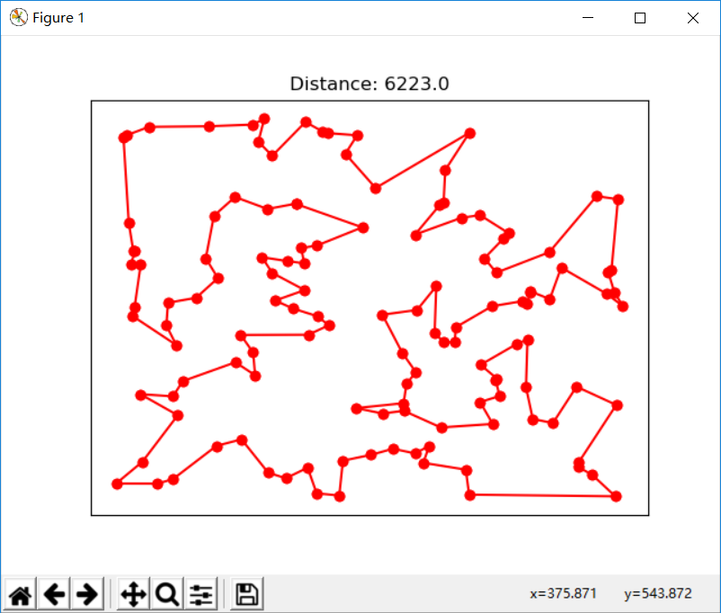
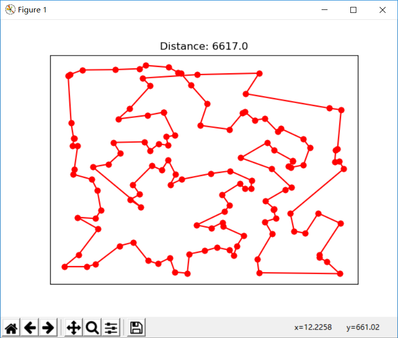

# Traveling Salesman Problem

## Introducation
[Travelling salesman problem](https://en.wikipedia.org/wiki/Travelling_salesman_problem)

## Solve

## Environment
* `Win 10`
* `Python 3`

### SA

#### Usage
```
python ./src/SA.py <filename>.tsp
```
* example 
    ```
    python ./src/SA.py ./assets/ch130.tsp
    ```
#### Result
*Problem:* `TSP - ch130`

**Optimal solutions for symmetric TSPs - ch130: `6110`**

`My Solution`



### GA

#### Usage
```
python ./src/GA.py <filename>.tsp
```
* example 
    ```
    python ./src/GA.py ./assets/ch130.tsp
    ```
#### Result
*Problem:* `TSP - ch130`

**Optimal solutions for symmetric TSPs - ch130: `6110`**

`My Solution`
