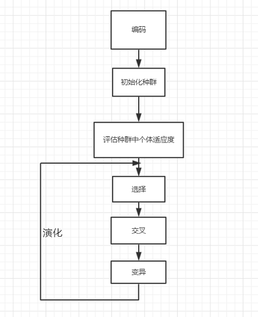
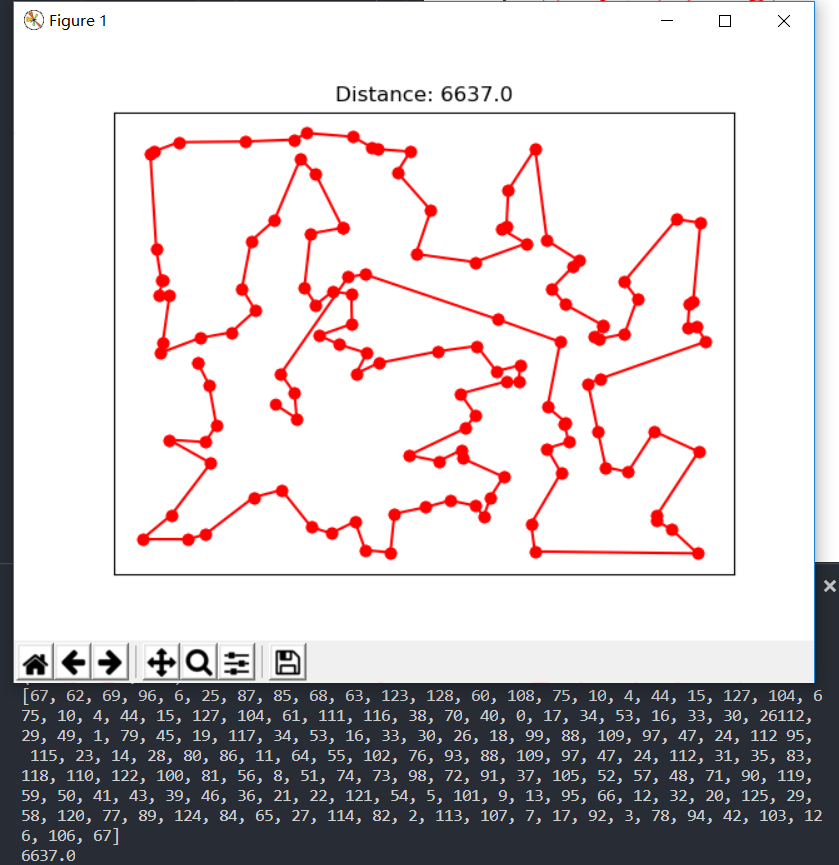

# Genetic Algorithm

> 遗传算法(Genetic Algorithm, GA)是Holland在20世纪60年代末提出的，是受遗传学中自然选择和遗传机制启发发展起来的一种搜索算法。它的基本思想是使用模拟生物和人类进化的方法求解复杂的优化问题，因而也称为模拟进化优化算法。模拟进化优化算法在计算原理上是自适应的，结构上是并行的，而且模仿了人的智能处理特征，因而成为人工智能的一个重要研究领域。

## 导言
* 在[TSPLIB](http://comopt.ifi.uni-heidelberg.de/software/TSPLIB95/)中选一个大于100个城市数的TSP问题，使用遗传算法求解TSP问题
* 实验环境 `Win 10` + `Python 3`

## GA算法流程


`Code`
```python
# 初始化种群
population = initPopulation(cities, numOfCity)

# 演化
curGen = 0 
while curGen < MAXGENS:
    random.shuffle(population)
    # 选择
    population = select(population, numOfCity)
    # 交叉
    population = crosscover(population, numOfCity)
    # 变异
    population = mutate(population, numOfCity)
    # 引入局部搜索，加强进化
    population = localSearch(population, numOfCity)
```

### 初始化种群
关于种群初始化，其实默认是比较容易的，即随机生成种群即可。但是实验起来发现随机生成初始种群，其收敛效果很差并且效率很低。因此在初始化种群的时候加入部分贪心生成的个体，加快种群成熟速度，也保证了种群中个体的多样性。对于贪心个体的生成，直接使用贪心算法生成，每个结点都选择下一个未被加入路径的最近结点，但是经过测试，发现加入贪心个体的数目不宜过多，否则将导致过于早熟。
```python
# Initial population
def initPopulation(cities, numOfCity):
    population = []

    individual = [i for i in range(numOfCity)]
    for _ in range(int(POPSIZE * 2 / 10)):
        random.shuffle(individual)
        population.append(individual[:])    

    for _ in range(int(POPSIZE - len(population))):
        start = random.randint(0, numOfCity-1)
        gIndividual = []
        gIndividual.append(start)
        j = 1
        while j < numOfCity:
            mixDis = float_info.max 
            i, bestId = 0, 0
            while i < numOfCity:
                if (i not in gIndividual) and i != gIndividual[-1] and distance[gIndividual[-1]][i] < mixDis:
                    bestId = i
                    mixDis = distance[gIndividual[-1]][i]
                i += 1
            j = j + 1
            gIndividual.append(bestId)
        population.append(gIndividual[:]) 
    
    random.shuffle(population)
    return population
```

### 个体适应度计算
关于适应度评估，其适应度等于该路径的的倒数，即`1 / totalDistance`
```python
# calculate indibidual fitness
def evaluate(individual):
    fitness = 0.0
    for i in range(len(individual) - 1):
        fitness += distance[individual[i]][individual[i+1]]
    # back to starting point
    fitness += distance[individual[len(individual)-1]][individual[0]]
    return fitness
```

### 选择
使用比较通用的[轮盘赌](https://www.cnblogs.com/legend1130/archive/2016/03/29/5333087.html)，同时选择其他的选择策略的效果也是不错的

```python
# selection operation
def select(population, numOfCity):
    newPopulation = []
    best = float_info.max
    bestId = 0
    fitness = []
    sumOfFitness = 0.0

    # evalute
    for i in range(POPSIZE):
        fit = evaluate(population[i])
        fitness.append(1 / fit)
        sumOfFitness += 1 / fit
        if (best > fit) :
            best = fit
            bestId = i

    # choosing the best individual to directly inherit to the next generation
    newPopulation.append(population[bestId])

    # cumulative probability
    cumPro = []
    for i in range(POPSIZE):
        if i == 0:
            cumPro.append(fitness[i] / sumOfFitness)
        else:
            cumPro.append(fitness[i] / sumOfFitness + cumPro[i-1])       
    
    # roulette selection of offspring
    for i in range(POPSIZE-1):
        pro = random.random()
        for j in range(POPSIZE):
            if cumPro[j] >= pro:
                newPopulation.append(population[j])
                break
    return newPopulation
```

### 交叉
关于交叉操作，取随机的两条染色体i,j，有一定的概率进行交叉。这部分使用[次序交叉法(Order Crossover)](https://en.wikipedia.org/wiki/Crossover_(genetic_algorithm))
```python
# order crossover
subPopulation = []
for i in range(POPSIZE):
    if random.random() <= PXOVER:
        chromosomeFir = random.randint(0, POPSIZE - 1)
        chromosomeSec = random.randint(0, POPSIZE - 1)
        while chromosomeFir == chromosomeSec:
            chromosomeSec = random.randint(0, POPSIZE - 1)
        start = random.randint(0, numOfCity - 2)
        end = random.randint(start + 1, numOfCity - 1)
        newIndividual_i = []
        newIndividual_j = []
        k = 0
        for j in range(numOfCity):
            if j >= start and j < end:
                newIndividual_i.append(population[chromosomeFir][j])
                j = end
            else:
                while k < numOfCity:
                    if population[chromosomeSec][k] not in population[chromosomeFir][start:end]:
                        newIndividual_i.append(population[chromosomeSec][k])
                        k += 1
                        break
                    k += 1
        k = 0      
        for j in range(numOfCity):
            if population[chromosomeSec][j] in population[chromosomeFir][start:end]:
                newIndividual_j.append(population[chromosomeSec][j])
            else:
                if k == start:
                    k = end
                newIndividual_j.append(population[chromosomeFir][k])
                k += 1
        subPopulation.append(newIndividual_i[:])
        subPopulation.append(newIndividual_j[:])
```
但是对于结果生成的子代，并非都直接将其替换父代加入，而是再将生成的子代与父代进行一定的竞争，如果不进行筛选的话，算法的收敛速度太慢
```python
# competition
subPopulation.sort(key = lambda x: evaluate(x))
for i in range(len(subPopulation)):
    for j in range(POPSIZE):
        if evaluate(subPopulation[i]) < evaluate(population[j]):
            population[j] = subPopulation[i]
            break
```

### 变异
关于变异，使用两种变异操作。种群中每个个体的每个结点看作一个基因，第一种变异操作为将两个基因之间的基因片段反转，第二种变异操作则只是将两个基因的位置对换
```python
# mutation operation
def mutate(population, numOfCity):
    for i in range(len(population)):
        if random.random() <= PMUTATION:
            geneFir = random.randint(1,numOfCity-2)
            geneSec = random.randint(geneFir+1, numOfCity-1)
            population[i][geneFir:geneSec] = population[i][geneSec-1:geneFir-1:-1]
        if random.random() <= PMUTATION:
            geneFir = random.randint(0,numOfCity-1)
            geneSec = random.randint(0, numOfCity-1)
            while geneFir == geneSec:
                geneSec = random.randint(0, numOfCity-1)
            population[i][geneFir], population[i][geneSec] = population[i][geneSec], population[i][geneFir]
    return population
```

## 效果
* 测试 `TSP - ch130`
* `Optimal solutions for symmetric TSPs - ch130: 6110`
* 设置
  * 种群大小 `50`
  * 遗传代数 `1000`
  * 交叉概率 `0.9`
  * 变异概率 `0.2 `
* 运行结果
    
* 算法本次测试结果为 `6637(8.63%)` ，参考最佳结果为 `6110` 。**大多数情况下，算法与最优参考解的平均差值为`9%`，最优的结果为`6627.0`，误差为`8.5%`。**


## 总结

### 遗传算法的优化思路
* 控制参数的选取方面。对于**种群规模**的设置上，一般情况为`20~200`，对于问题规模比较大的情况，其含有比较多的模式，我们需要提供足够的模式采样容量，这样也可以防止在成熟期前就收敛。**交叉概率**的选择上，一般取`0.6~1.0`，交叉率越高，群体中新结构的引入越快，已获得的优良的基因结果的丢失速度也相应升高，而交叉概率太低则可能导致搜索效率阻塞。**变异概率**一般取`0.005~0.2`。
* 在**初始化种群的时候可以加入部分贪心算法生成的个体**，这样可以使得种群的收敛比较好。但是贪心生成的个体的比列不宜过高，否则可能导致提前收敛，陷入局部最优，此时得到的最优解近似贪心生成的最优个体的解。
* **合理有效的交叉操作**。一个合理有效的交叉操作对于遗传算法的效率有着比较大的影响。初始本来使用单点交叉、两点交叉以及多点交叉，但是效果都相当的差，现在使用的是顺序交叉，效果可以达到与问题最优解差值10%以内，但是效率仍然不是很理想。
* **引入局部搜索，增强进化的方向**。

### GA与SA的比较
所设计的`遗传算法（GA）`与`模拟退火算法（SA）`相比，`GA`的效率比`SA`低，个人认为主要是目前所设计的交叉操作仍然不够理想，使得其在后期导致搜索阻滞，未能够得到一个更优解。但是`GA`的改进空间比`SA`应该是更大的，在解决问题上，`GA`提供了更多的可选模式，可以多个模式进行一系列操作进行改进，`SA`则是在当前模式上进行操作，`GA`更容易跳出局部最优。